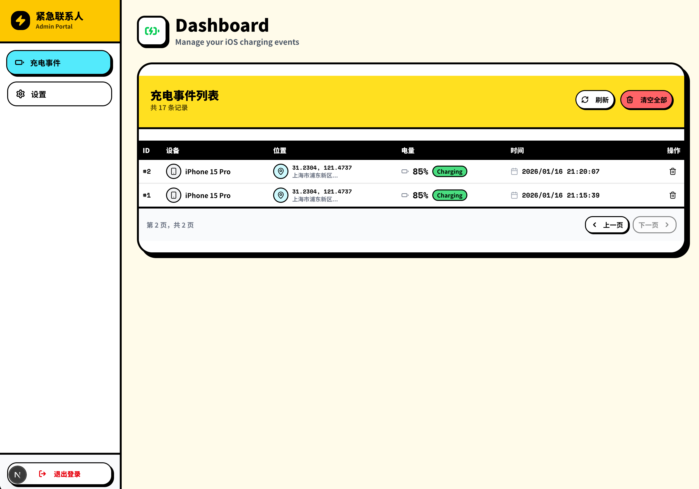

# 紧急联系人 (Emergency Contact) - iOS 充电事件监控

一个基于 Next.js 的设备状态监控系统，专门设计用于接收 iOS 快捷指令（Shortcuts）发送的充电与位置信息。能够自动记录设备的最后位置、电量，并在设备长时间未响应时发送邮件提醒，作为独居人士或老人的安全保障工具。



## ✨ 主要功能

- **🚀 快捷指令集成**：原生支持 iOS 快捷指令，通过 POST 请求自动汇报状态。
- **📍 位置与电量追踪**：记录充电时的地理位置、电池电量、设备型号等信息。
- **🔔 异常预警**：可设定"安全确认"时间间隔（如 24 小时），若超过指定时间无充电记录，自动发送邮件报警。
- **🔐 安全机制**：
  - **API Key 验证**：保护数据上报接口不被滥用。
  - **登录保护**：管理后台具备防暴力破解功能（IP 锁定机制）。
- **📊 管理后台**：现代化 Neo-Brutalist 风格 UI，可视化查看历史记录和管理系统设置。
- **🐳 Docker 部署**：支持一键 Docker 部署，数据持久化。

## 🚀 快速开始

### 使用 Docker 部署 (推荐)

本项目已构建为 Docker 镜像，可直接部署。

1. **创建数据目录**：
   ```bash
   mkdir -p location-data/data
   cd location-data
   ```

2. **启动容器**：
   ```bash
   docker run -d \
     --name location-api \
     -p 3000:3000 \
     -e ADMIN_USERNAME="admin" \
     -e ADMIN_PASSWORD="your_secure_password" \
     -v $(pwd)/data:/app/data \
     ghcr.io/hst-Sunday/SoloLink:latest
   ```

3. **访问系统**：
   - 首页：`http://localhost:3000`
   - 快速接入指南：`http://localhost:3000/start`
   - 管理后台：`http://localhost:3000/login`

### 环境变量说明

| 变量名 | 必填 | 默认值 | 说明 |
|--------|------|--------|------|
| `ADMIN_USERNAME` | ✅ | - | 管理后台登录用户名 |
| `ADMIN_PASSWORD` | ✅ | - | 管理后台登录密码 |
| `NODE_ENV` | ❌ | production | 运行环境 |
| `PORT` | ❌ | 3000 | 服务端口 |

### 系统配置 (管理后台)

登录后台后，在 **设置** 页面可配置以下重要参数：
- **API Key**：设置后，iOS 快捷指令必须携带此 Key 才能上报数据。
- **邮件服务 (SMTP)**：配置发送报警邮件的 SMTP 服务器信息（推荐使用 QQ 邮箱或 Gmail）。
- **报警规则**：设置无响应超时时间（如 24 小时）和收件人邮箱。

## 📱 iOS 快捷指令配置

系统内置了详细的图形化接入指南。

1. 部署完成后，并在手机上访问 `/start` 页面（例如 `https://your-domain.com/start`）。
2. 跟随页面指引下载快捷指令。
3. 在快捷指令中配置你的服务器域名。
4. 设置 iOS 自动化：**"当连接电源时" -> "运行快捷指令"**。

**手动配置 API 接口：**
- **URL**: `POST https://your-domain.com/api/location`
- **Headers**:
  - `Content-Type`: `application/json`
  - `x-api-key`: `(在后台设置的 API Key)` (选填)
- **Body** (JSON):
  ```json
  {
    "latitude": "31.2304",
    "longitude": "121.4737",
    "address": "上海市...",
    "battery_level": 80,
    "is_charging": true,
    "device_name": "iPhone",
    "device_model": "iPhone15,3"
  }
  ```

## 🛠️ 本地开发

需要 Node.js 24+ 环境。

1. **克隆项目**
   ```bash
   git clone https://github.com/hst-Sunday/SoloLink.git
   cd SoloLink
   ```

2. **安装依赖**
   ```bash
   npm install
   # 或
   pnpm install
   ```

3. **配置环境变量**
   复制 `.env.sample` 文件并设置管理员账号：
   ```bash
   cp .env.sample .env
   echo "ADMIN_USERNAME=admin" > .env
   echo "ADMIN_PASSWORD=admin123" >> .env
   ```

4. **启动开发服务器**
   ```bash
   npm run dev
   ```

## 🔒 隐私说明

本系统设计为私有化部署工具，所有位置数据存储在你自建的服务器 SQLite 数据库中。数据完全归你所有，不会上传到任何第三方云服务。

## 📄 许可证

MIT License
